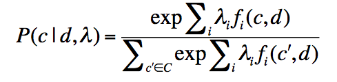



## Deep Learning for NLP(without Magic)笔记

### 0.背景简介
目前机器学习基于人工设计的特征，机器学习只是优化参数权重已达到好的预测效果。

表示学习：尝试自动学习好的特征来表示数据

深度学习：尝试学习多层的表示，以增加复杂度和抽象度。

研究深度学习的五个原因：

1. 表示性学习：手工设计特征复杂耗时

2. distributed representation的必要性：NLP中原子表示法的脆弱性。

   基于聚类的Distribional similarity效果很好：

   * 语法分析 **Brown clustering**

   * 实体识别 **Standford NER, exchange clustering**

   Distributed representations可处理维数灾难。

   解决方案：
   * 手工设计特征
   * 假设光滑目标函数
   * 核函数方法

3. 非监督的特征和权重学习
   现在，多数NLP/ML方法需要标记好的训练数据，不过大部分数据都是未标注的。因此需要非监督的学习。

4. 学习多层表示
   我们需要有用的中间层表示。We need composi>onality in our ML models.
   循环/递归：相同的算子应用在不同的部分上。

5. 为什么现在？
	2006年之前，deep architectures没有成功。
	改变：
	* 提出了关于非监督的预训练方法 **RBM, autoencoders, contrastive estimation**
	* 更有效的参数估计方法
	* 更好的理解模型正则化

**DL取得很好的效果**：

*  Neural Language Model
*  SENNA POS（词性分析） NER（实体识别）
*  多核CPU和GPU使得计算速度大幅提升

### 1.基础知识
#### 1.1 Motivations
#### 1.2 从逻辑回归到神经网络

##### 单神经元

* n个输入
* 1个输出
* 偏置单元
* 激活函数
* 参数W,b

##### 从Maxent分类器到神经网络

##### 单个神经元计算：

h_wb(x) = f(wx+b)
f(z) = 1/(1+e^(-z))

##### 神经网络=同时运行多个逻辑回归

训练W:

* 对有监督的单层神经网络，我们可以和训练最大熵模型一样，通过梯度来训练。
   * SGD
   * 对偶梯度(Conjugate gradient 或 L-BFGS)

> 		问题1：对偶梯度(Conjugate gradient 或 L-BFGS

* 多层网络较复杂，因为中间隐层逻辑单元使得方程非凸，就像hidden CRFS。不过我们可以应用相同的思路和方法，后向传播算法。

为什么需要非线性：

* 对逻辑回归来说，映射到概率。
* 函数逼近，比如回归，分类。
  * 如果没有非线性，深层神经网络并不能比线性变换做更多的事情。因为多层线性总可以转换为复杂的单层线性变换。
  * 除了在Boltzmann机/图模型下，概率理解并不是必须的。人们经常用其他非线性变换，比如tanh。
  
基本概念总结：

* 神经元 = 逻辑回归或相似函数
* 输入层 = 输入 训练/测试 向量
* 偏置单元 = 截距项
* 激活 = 反应
* 激活函数 是 logistic函数，或其他sigmoid非线性函数
* 后向传播 =  应用在多层网络上的随机梯度下降
* 权重衰退 = 正则化/Bayesian先验

非监督预训练使得有效的深度学习变为可能

#### 1.3 词表示(Wordrepresentations)

**The standard word representation**

向量空间模型中，向量由一个1和很多0组成：
> [0, 0, …, 0, 1, 0, …, 0]

维数：20k(Speech)-50k(PTB)-500k(big vocab)-13M(Google 1T)

称作“one-hot”representation。

存在的问题：每个词被孤立起来，比如motel和hotel相似度为0.

**Distributional similarity based representations**

**Class-based (hard) and soft clustering word representations**

*  Brown clustering (Brown et al. 1992)
*  Exchange clustering (Clark 2003)
*  Desparsification and great example of unsupervised pre-training

软分类模型学习了在每一类中都有一个单词分布:

* LSA
* LDA, HMM

**Neural word embeddings as a distributed representation**

> (Bengio et al. 2003, Collobert & Weston 2008, Turian et al. 2010)

单词被表示为一个紧致的向量。

**Advantages of the neural word embedding approach**

neural word embeddings通过增加有监督过程更有意义。

#### 1.4 非监督词向量的学习

**A neural network for learning word vectors (Collobert et al. JMLR 2011)**

思路：一个单词和文本作为正样本；一个随机的单词在相同的文本中作为负样本。

实现：

> score(cat chills on a mat) > score(cat chills Jeju a mat)

怎样计算得分：

* 应用神经网络
*  每个词表示为n维向量

**Word embedding matrix**

随机初始化所有的词向量，组成word embedding matrix L: n\*|V|

从L中得到每个单词的向量：x = Le, 其中e为one-hot向量，表示单词表|V|中第i个单词。

**计算得分**
score(cat chills in a mat):

* 表示短语：从L中得到每个单词的表示，cat: n\*1, chills: n\*1, …
* 连接所有单词，组成5\*n的向量x: 5n\*1

3层神经网络：

s = score(cat chills on a mat)

	s = U^T*f(Wx+b), x:20,1 W:8,20 U:8,1
	s = U^T*a 
	a = f(z)
	z = Wx+b
	x = [x_cat x_chills x_on x_a x_mat]
	L: n*|V|  这里n=4
	
s_c = score(cat chills Jeju a mat)

**目标函数**

最大化s,最小化s_c，即最小化下式：

	J = max(0, 1 - s + s_c)
	
>		很奇怪，为什么要定义上式，而不是max(s - s_c)

它是连续的，因此可以应用SGD。

假设损失J>0，我们可以计算s, s_c关于变量:U, W, b, x的偏导数

	∂s/∂U = ∂(U^T*a)/∂U
	∂s/∂U = a
**应用后向传播训练**

	∂s/∂W = ∂(U^T*a)/∂W = ∂/∂W(U^T*f(z)) = ∂/∂W(U^T*f(Wx+b))

W_ij只出现在a_i中，例如：W_23只用来计算a_2

	∂/∂W_ij(U^T*a) = ∂/∂W_ij(U_i*a_i)
	∂/∂W_ij(U_i*a_i) = U_i * ∂a_i/∂W_ij
	                 = U_i * ∂a_i/∂z_i * ∂z_i/W_ij
	                 = U_i * f'(z_i) * ∂z_i/W_ij
	                 = U_i * f'(z_i) * ∂/W_ij(W_i*x+b_i)
	                 = U_i * f'(z_i) * ∂/W_ij(∑W_ik*x_k)
	                 = U_i * f'(z_i) * x_j
	                 = delta_i * x_j
	delta_i = U_i * f'(z_i) 称作‘局部误差信号’
	x_j 称作‘局部输入信号’
	
从W_ij 到W:

	∂J/∂W = delta * x^T

对偏置单元b:

	∂/∂b_i(U_i*a_i) = U_i * ∂a_i/∂b_i 
	                = U_i * f'(z_i) * ∂(W_i*x+b_i)/∂b_i
	                = delta_i
	
	∂s/∂x_j = … = delta^T * W_.j
	
#### 1.5 后向传播训练

简单的链式法则：

	z = f(y); y = g(x); ∂z/∂x = ∂z/∂y * ∂y/∂x
	∆z = ∂z/∂y * ∆y; ∆y = ∂y/∂x * ∆x; ∆z = ∂z/∂y * ∂y/∂x * ∆x

多路径链式法则：
	
	z = f(y_1, y_2, …, y_n)
	∂z/∂x = ∑∂z/∂y_i * ∂y_i/∂x

Chain Rule in Flow Graph:

Flow Graph: 任意有向非循环图

1. 前向传播

2. 后向传播

#### 1.6 学习词级别的分类器：POS（词性标注）, NER(实体识别)

**模型**

	(Collobert & Weston 2008; Collobert et al. 2011)

* 类似词向量学习过程，把单个得分替换为Softmax/Maxent 分类器

* 类似于词向量模型中，通过后向传播训练。

#### 1.7 Sharing statistical strength

**Auto-encoders**

多层神经网络，目标：output = input

重构 = decoder(encoder(input))

	a = tanh(Wx + b)
	x' = tanh(W^T*x + b)
	cost = ||x' - x||^2

目标： 使得重构误差最小

**PCA**

PCA = Linear Manifold = Linear Auto-Encoder

**自编码学习凸变量，就像非线性的PCA**

**Auto-Encoder Variants**

离散输入：交叉熵或log-likelihood重构标准

Preventing them to learn the identity everywhere:

* Undercomplete(eg PCA): boCleneck code smaller than input

* Sparsity: penalize hidden unit ac>va>ons so at or near 0

* Denoising: predict true input from corrupted input

* Contractive: force encoder to have small deriva>ves 

**Stacking Auto-Encoders**

将多个自编码器堆积在一起，组成更复杂的非线性表示。

**逐层非监督训练**

### 2.Recursive Neural Networks

递归神经网络

#### 2.1 Motivation
#### 2.2 RecursiveNeuralNetworksforParsing
#### 2.3 Theory: Backpropaga>on Through Structure
#### 2.4 RecursiveAutoencoders
#### 2.5 应用到情感分析和Paraphrase Detection
#### 2.6 Compositionality Through Recursive Matrix-VectorSpaces
#### 2.7 Relation classification
### 3.应用，讨论，相关资料
#### 3.1 应用
#### 3.2 相关资料(readings, code)
#### 3.3 Tricks of the trade
#### 3.4 讨论：局限性，优势，未来研究方向
